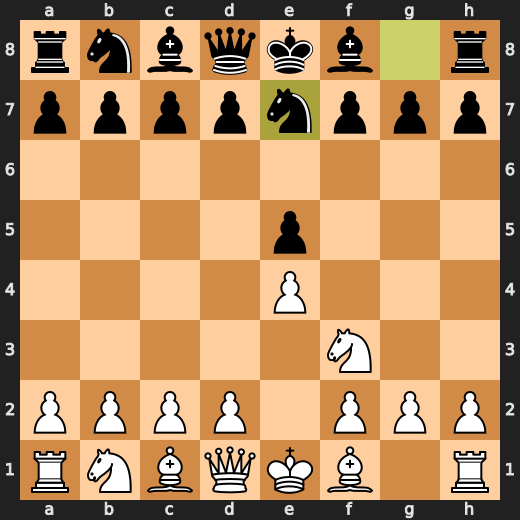

Move a **<!-- BEGIN TURN -->white<!-- END TURN -->** piece.

<table>
<tr>
<td valign="top">

<!-- BEGIN CHESS BOARD -->

<!-- END CHESS BOARD -->

</td>
<td valign="top">

<!-- BEGIN MOVES LIST -->
| FROM | TO |
| :---: | :--- |
| **A2** | [A3](https://github.com/jeonjw85/jeonjw85/issues/new?title=Chess%3A%20Move%20A2%20to%20A3&body=Just%20click%20Submit%20new%20issue%21%21%20Do%20not%20change%20the%20title.), [A4](https://github.com/jeonjw85/jeonjw85/issues/new?title=Chess%3A%20Move%20A2%20to%20A4&body=Just%20click%20Submit%20new%20issue%21%21%20Do%20not%20change%20the%20title.) |
| **B1** | [A3](https://github.com/jeonjw85/jeonjw85/issues/new?title=Chess%3A%20Move%20B1%20to%20A3&body=Just%20click%20Submit%20new%20issue%21%21%20Do%20not%20change%20the%20title.), [C3](https://github.com/jeonjw85/jeonjw85/issues/new?title=Chess%3A%20Move%20B1%20to%20C3&body=Just%20click%20Submit%20new%20issue%21%21%20Do%20not%20change%20the%20title.) |
| **B2** | [B3](https://github.com/jeonjw85/jeonjw85/issues/new?title=Chess%3A%20Move%20B2%20to%20B3&body=Just%20click%20Submit%20new%20issue%21%21%20Do%20not%20change%20the%20title.), [B4](https://github.com/jeonjw85/jeonjw85/issues/new?title=Chess%3A%20Move%20B2%20to%20B4&body=Just%20click%20Submit%20new%20issue%21%21%20Do%20not%20change%20the%20title.) |
| **C2** | [C3](https://github.com/jeonjw85/jeonjw85/issues/new?title=Chess%3A%20Move%20C2%20to%20C3&body=Just%20click%20Submit%20new%20issue%21%21%20Do%20not%20change%20the%20title.), [C4](https://github.com/jeonjw85/jeonjw85/issues/new?title=Chess%3A%20Move%20C2%20to%20C4&body=Just%20click%20Submit%20new%20issue%21%21%20Do%20not%20change%20the%20title.) |
| **D1** | [E2](https://github.com/jeonjw85/jeonjw85/issues/new?title=Chess%3A%20Move%20D1%20to%20E2&body=Just%20click%20Submit%20new%20issue%21%21%20Do%20not%20change%20the%20title.) |
| **D2** | [D3](https://github.com/jeonjw85/jeonjw85/issues/new?title=Chess%3A%20Move%20D2%20to%20D3&body=Just%20click%20Submit%20new%20issue%21%21%20Do%20not%20change%20the%20title.), [D4](https://github.com/jeonjw85/jeonjw85/issues/new?title=Chess%3A%20Move%20D2%20to%20D4&body=Just%20click%20Submit%20new%20issue%21%21%20Do%20not%20change%20the%20title.) |
| **E1** | [E2](https://github.com/jeonjw85/jeonjw85/issues/new?title=Chess%3A%20Move%20E1%20to%20E2&body=Just%20click%20Submit%20new%20issue%21%21%20Do%20not%20change%20the%20title.) |
| **F1** | [A6](https://github.com/jeonjw85/jeonjw85/issues/new?title=Chess%3A%20Move%20F1%20to%20A6&body=Just%20click%20Submit%20new%20issue%21%21%20Do%20not%20change%20the%20title.), [B5](https://github.com/jeonjw85/jeonjw85/issues/new?title=Chess%3A%20Move%20F1%20to%20B5&body=Just%20click%20Submit%20new%20issue%21%21%20Do%20not%20change%20the%20title.), [C4](https://github.com/jeonjw85/jeonjw85/issues/new?title=Chess%3A%20Move%20F1%20to%20C4&body=Just%20click%20Submit%20new%20issue%21%21%20Do%20not%20change%20the%20title.), [D3](https://github.com/jeonjw85/jeonjw85/issues/new?title=Chess%3A%20Move%20F1%20to%20D3&body=Just%20click%20Submit%20new%20issue%21%21%20Do%20not%20change%20the%20title.), [E2](https://github.com/jeonjw85/jeonjw85/issues/new?title=Chess%3A%20Move%20F1%20to%20E2&body=Just%20click%20Submit%20new%20issue%21%21%20Do%20not%20change%20the%20title.) |
| **F3** | [D4](https://github.com/jeonjw85/jeonjw85/issues/new?title=Chess%3A%20Move%20F3%20to%20D4&body=Just%20click%20Submit%20new%20issue%21%21%20Do%20not%20change%20the%20title.), [E5](https://github.com/jeonjw85/jeonjw85/issues/new?title=Chess%3A%20Move%20F3%20to%20E5&body=Just%20click%20Submit%20new%20issue%21%21%20Do%20not%20change%20the%20title.), [G1](https://github.com/jeonjw85/jeonjw85/issues/new?title=Chess%3A%20Move%20F3%20to%20G1&body=Just%20click%20Submit%20new%20issue%21%21%20Do%20not%20change%20the%20title.), [G5](https://github.com/jeonjw85/jeonjw85/issues/new?title=Chess%3A%20Move%20F3%20to%20G5&body=Just%20click%20Submit%20new%20issue%21%21%20Do%20not%20change%20the%20title.), [H4](https://github.com/jeonjw85/jeonjw85/issues/new?title=Chess%3A%20Move%20F3%20to%20H4&body=Just%20click%20Submit%20new%20issue%21%21%20Do%20not%20change%20the%20title.) |
| **G2** | [G3](https://github.com/jeonjw85/jeonjw85/issues/new?title=Chess%3A%20Move%20G2%20to%20G3&body=Just%20click%20Submit%20new%20issue%21%21%20Do%20not%20change%20the%20title.), [G4](https://github.com/jeonjw85/jeonjw85/issues/new?title=Chess%3A%20Move%20G2%20to%20G4&body=Just%20click%20Submit%20new%20issue%21%21%20Do%20not%20change%20the%20title.) |
| **H1** | [G1](https://github.com/jeonjw85/jeonjw85/issues/new?title=Chess%3A%20Move%20H1%20to%20G1&body=Just%20click%20Submit%20new%20issue%21%21%20Do%20not%20change%20the%20title.) |
| **H2** | [H3](https://github.com/jeonjw85/jeonjw85/issues/new?title=Chess%3A%20Move%20H2%20to%20H3&body=Just%20click%20Submit%20new%20issue%21%21%20Do%20not%20change%20the%20title.), [H4](https://github.com/jeonjw85/jeonjw85/issues/new?title=Chess%3A%20Move%20H2%20to%20H4&body=Just%20click%20Submit%20new%20issue%21%21%20Do%20not%20change%20the%20title.) |
<!-- END MOVES LIST -->

</td>
</tr>
</table>
