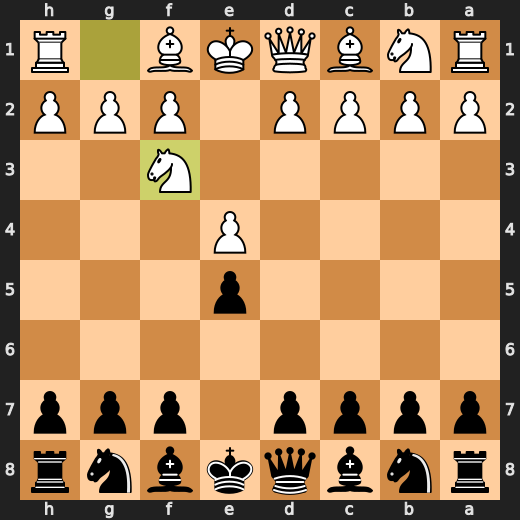

Move a **<!-- BEGIN TURN -->black<!-- END TURN -->** piece.

<table>
<tr>
<td valign="top">

<!-- BEGIN CHESS BOARD -->

<!-- END CHESS BOARD -->

</td>
<td valign="top">

<!-- BEGIN MOVES LIST -->
| FROM | TO |
| :---: | :--- |
| **A7** | [A5](https://github.com/jeonjw85/jeonjw85/issues/new?title=Chess%3A%20Move%20A7%20to%20A5&body=Just%20click%20Submit%20new%20issue%21%21%20Do%20not%20change%20the%20title.), [A6](https://github.com/jeonjw85/jeonjw85/issues/new?title=Chess%3A%20Move%20A7%20to%20A6&body=Just%20click%20Submit%20new%20issue%21%21%20Do%20not%20change%20the%20title.) |
| **B7** | [B5](https://github.com/jeonjw85/jeonjw85/issues/new?title=Chess%3A%20Move%20B7%20to%20B5&body=Just%20click%20Submit%20new%20issue%21%21%20Do%20not%20change%20the%20title.), [B6](https://github.com/jeonjw85/jeonjw85/issues/new?title=Chess%3A%20Move%20B7%20to%20B6&body=Just%20click%20Submit%20new%20issue%21%21%20Do%20not%20change%20the%20title.) |
| **B8** | [A6](https://github.com/jeonjw85/jeonjw85/issues/new?title=Chess%3A%20Move%20B8%20to%20A6&body=Just%20click%20Submit%20new%20issue%21%21%20Do%20not%20change%20the%20title.), [C6](https://github.com/jeonjw85/jeonjw85/issues/new?title=Chess%3A%20Move%20B8%20to%20C6&body=Just%20click%20Submit%20new%20issue%21%21%20Do%20not%20change%20the%20title.) |
| **C7** | [C5](https://github.com/jeonjw85/jeonjw85/issues/new?title=Chess%3A%20Move%20C7%20to%20C5&body=Just%20click%20Submit%20new%20issue%21%21%20Do%20not%20change%20the%20title.), [C6](https://github.com/jeonjw85/jeonjw85/issues/new?title=Chess%3A%20Move%20C7%20to%20C6&body=Just%20click%20Submit%20new%20issue%21%21%20Do%20not%20change%20the%20title.) |
| **D7** | [D5](https://github.com/jeonjw85/jeonjw85/issues/new?title=Chess%3A%20Move%20D7%20to%20D5&body=Just%20click%20Submit%20new%20issue%21%21%20Do%20not%20change%20the%20title.), [D6](https://github.com/jeonjw85/jeonjw85/issues/new?title=Chess%3A%20Move%20D7%20to%20D6&body=Just%20click%20Submit%20new%20issue%21%21%20Do%20not%20change%20the%20title.) |
| **D8** | [E7](https://github.com/jeonjw85/jeonjw85/issues/new?title=Chess%3A%20Move%20D8%20to%20E7&body=Just%20click%20Submit%20new%20issue%21%21%20Do%20not%20change%20the%20title.), [F6](https://github.com/jeonjw85/jeonjw85/issues/new?title=Chess%3A%20Move%20D8%20to%20F6&body=Just%20click%20Submit%20new%20issue%21%21%20Do%20not%20change%20the%20title.), [G5](https://github.com/jeonjw85/jeonjw85/issues/new?title=Chess%3A%20Move%20D8%20to%20G5&body=Just%20click%20Submit%20new%20issue%21%21%20Do%20not%20change%20the%20title.), [H4](https://github.com/jeonjw85/jeonjw85/issues/new?title=Chess%3A%20Move%20D8%20to%20H4&body=Just%20click%20Submit%20new%20issue%21%21%20Do%20not%20change%20the%20title.) |
| **E8** | [E7](https://github.com/jeonjw85/jeonjw85/issues/new?title=Chess%3A%20Move%20E8%20to%20E7&body=Just%20click%20Submit%20new%20issue%21%21%20Do%20not%20change%20the%20title.) |
| **F7** | [F5](https://github.com/jeonjw85/jeonjw85/issues/new?title=Chess%3A%20Move%20F7%20to%20F5&body=Just%20click%20Submit%20new%20issue%21%21%20Do%20not%20change%20the%20title.), [F6](https://github.com/jeonjw85/jeonjw85/issues/new?title=Chess%3A%20Move%20F7%20to%20F6&body=Just%20click%20Submit%20new%20issue%21%21%20Do%20not%20change%20the%20title.) |
| **F8** | [A3](https://github.com/jeonjw85/jeonjw85/issues/new?title=Chess%3A%20Move%20F8%20to%20A3&body=Just%20click%20Submit%20new%20issue%21%21%20Do%20not%20change%20the%20title.), [B4](https://github.com/jeonjw85/jeonjw85/issues/new?title=Chess%3A%20Move%20F8%20to%20B4&body=Just%20click%20Submit%20new%20issue%21%21%20Do%20not%20change%20the%20title.), [C5](https://github.com/jeonjw85/jeonjw85/issues/new?title=Chess%3A%20Move%20F8%20to%20C5&body=Just%20click%20Submit%20new%20issue%21%21%20Do%20not%20change%20the%20title.), [D6](https://github.com/jeonjw85/jeonjw85/issues/new?title=Chess%3A%20Move%20F8%20to%20D6&body=Just%20click%20Submit%20new%20issue%21%21%20Do%20not%20change%20the%20title.), [E7](https://github.com/jeonjw85/jeonjw85/issues/new?title=Chess%3A%20Move%20F8%20to%20E7&body=Just%20click%20Submit%20new%20issue%21%21%20Do%20not%20change%20the%20title.) |
| **G7** | [G5](https://github.com/jeonjw85/jeonjw85/issues/new?title=Chess%3A%20Move%20G7%20to%20G5&body=Just%20click%20Submit%20new%20issue%21%21%20Do%20not%20change%20the%20title.), [G6](https://github.com/jeonjw85/jeonjw85/issues/new?title=Chess%3A%20Move%20G7%20to%20G6&body=Just%20click%20Submit%20new%20issue%21%21%20Do%20not%20change%20the%20title.) |
| **G8** | [E7](https://github.com/jeonjw85/jeonjw85/issues/new?title=Chess%3A%20Move%20G8%20to%20E7&body=Just%20click%20Submit%20new%20issue%21%21%20Do%20not%20change%20the%20title.), [F6](https://github.com/jeonjw85/jeonjw85/issues/new?title=Chess%3A%20Move%20G8%20to%20F6&body=Just%20click%20Submit%20new%20issue%21%21%20Do%20not%20change%20the%20title.), [H6](https://github.com/jeonjw85/jeonjw85/issues/new?title=Chess%3A%20Move%20G8%20to%20H6&body=Just%20click%20Submit%20new%20issue%21%21%20Do%20not%20change%20the%20title.) |
| **H7** | [H5](https://github.com/jeonjw85/jeonjw85/issues/new?title=Chess%3A%20Move%20H7%20to%20H5&body=Just%20click%20Submit%20new%20issue%21%21%20Do%20not%20change%20the%20title.), [H6](https://github.com/jeonjw85/jeonjw85/issues/new?title=Chess%3A%20Move%20H7%20to%20H6&body=Just%20click%20Submit%20new%20issue%21%21%20Do%20not%20change%20the%20title.) |
<!-- END MOVES LIST -->

</td>
</tr>
</table>
